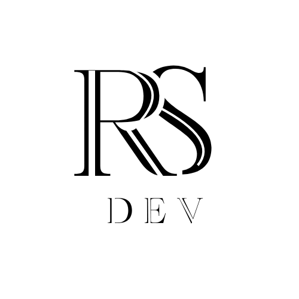

# RS Dev — digital product & growth studio



Modern **black and white monogram** mark: stylized **RS** above tracked **DEV** lettering — used sitewide as the brand logo and favicon.

## What RS Dev provides

- **Web apps** — websites, landing systems, customer portals, internal tools  
- **Custom software** — bespoke workflows, admin panels, integrations  
- **CRM** — setup, customization, pipelines, reporting, integrations  
- **SEO & ranking** — technical SEO, structure, performance, practical content guidance  
- **AI agents & AI bots** — grounded assistants with guardrails for real users or staff  
- **AI workflow automation** — connects AI steps to email, CRM, ticketing, and spreadsheets  
- **Digital marketing** — channel strategy, campaigns, tracking, messaging aligned to the product  
- **Consultancy** — roadmaps, tool choices, feasibility, and “what to build first”

Delivery can be **fixed phases**, **sprint embeds**, **advisory slices**, or a **light retainer** — see `content/RS_DEV_SITE_COPY.md` for full marketing copy.

## Stack (typical)

Next.js, React, TypeScript, Tailwind CSS, Python / FastAPI, integrations, auth patterns, and AI APIs — chosen per project.

## Repository

This repository hosts the **RS Dev** marketing site / portfolio build.

```bash
npm install
npm run dev
```

Open [http://localhost:3000](http://localhost:3000).

## Deploy notes

- Update `metadataBase` and canonical URLs in `config/index.ts`, plus `app/sitemap.ts` and `app/robots.ts`, when you connect a production domain.
- Contact form may call a separate API (`lib/api.ts`); configure the backend URL for production.

## License

Private project — **© RS Dev. All rights reserved.**
